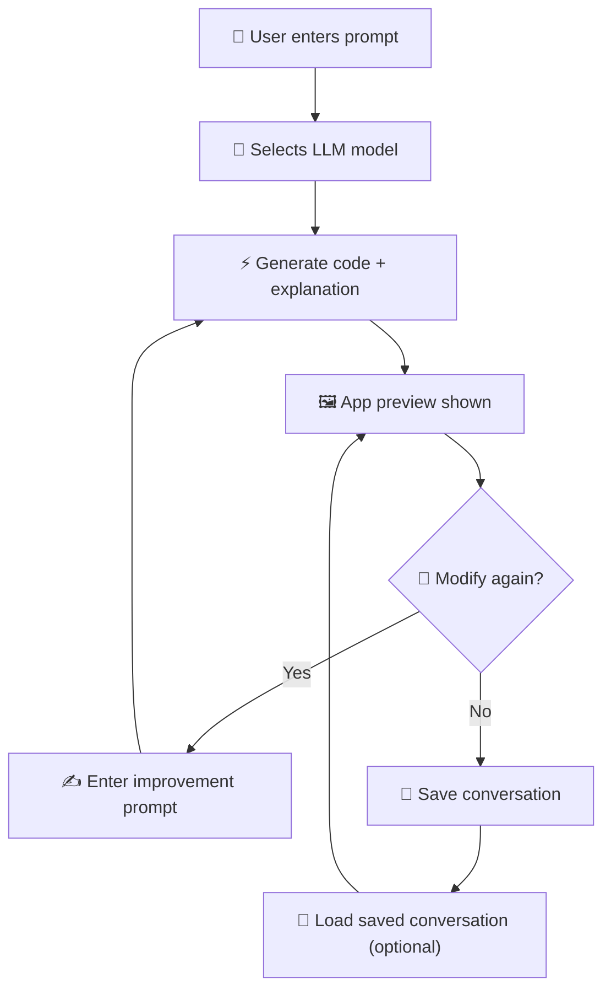

# AutoImprove – LLM-Powered App Generator

AutoImprove is a browser-based app that lets you generate, improve, and iterate on single-page HTML applications using LLMs (OpenAI, Anthropic, Gemini, OpenRouter, etc.). It provides a simple interface to configure your LLM provider, send prompts, and view code, explanations, and rendered previews side by side.

---

## ✨ Features

- ⚡ **Prompt-to-App**: Enter a natural language prompt and generate a single-page HTML app.
- 🔄 **Iterative Improvement**: Refine and improve apps with one click using contextual feedback.
- 🎨 **Rich UI**: Uses [Bootstrap 5](https://getbootstrap.com) + [Bootstrap Icons](https://icons.getbootstrap.com) for styling.
- 📝 **Markdown Rendering**: Explanations are rendered via [marked](https://github.com/markedjs/marked).
- 💻 **Safe Code Execution**: HTML code is sandboxed inside an `<iframe>`.
- 🎛 **LLM Configuration**: Switch providers (OpenAI, Anthropic, Gemini, OpenRouter) via [bootstrap-llm-provider](https://www.npmjs.com/package/bootstrap-llm-provider).
- 📂 **Demo Loader**: Load demo prompts from `config.json` or local `.json` files.
- 💾 **Conversation Save/Load**: Export your conversation history as JSON and reload it later.
- 🎨 **Dark/Light Theme**: Toggle Bootstrap themes and persist preference in `localStorage`.

---

## 📦 Tech Stack

- [lit-html](https://lit.dev/) – Efficient rendering engine  
- [asyncllm](https://www.npmjs.com/package/asyncllm) – Streaming LLM responses  
- [marked](https://github.com/markedjs/marked) – Markdown parsing  
- [bootstrap-llm-provider](https://www.npmjs.com/package/bootstrap-llm-provider) – UI for LLM provider configuration  
- Bootstrap 5 + Bootstrap Icons  

---
## ⚡ How It Works



## 🚀 Getting Started

### 1. Clone the Repository
```bash
git clone https://github.com/Nitin399-maker/autoimprove.git
cd autoimprove

